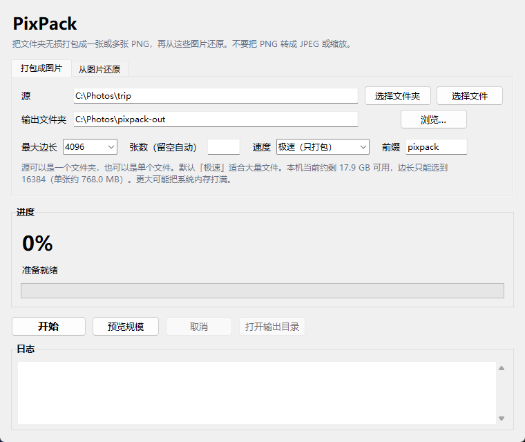

# PixPack

把一个文件或整个文件夹无损打包成一张或多张 PNG，再按原来的样子还原。支持 Windows 和 macOS。

图片看起来像彩噪点，它不是给人看的，只是一个不丢字节的容器。源是单个文件还是文件夹，会写进图片头里；还原时按这个标记自动处理，不用自己选择。



## 原理

1. 按相对路径把内容打成 zip。已经压缩过的文件默认不再二次压缩。
2. 在字节流前面加上 `PX01` 文件头：张数、序号、偏移、CRC32、整包 SHA-256，以及「单个文件 / 文件夹」标记。
3. 按行把字节写入 RGB 像素，每像素 3 字节，保存为 PNG。内存里只保留一行，不会把整张图再压缩一遍。
4. 解码时按行读像素、校验，拼到临时 zip，再按原相对路径写出。

默认单张最大边长 4096。装不下就自动分成多张，也可以用 `--parts` 指定张数。边长有上限，按本机当前剩余内存计算，避免一张图把内存打满。

**不要把 PNG 转成 JPEG，不要缩放，也不要经过会重新压缩图片的聊天软件或网盘预览。** 像素一变，文件就坏了。

## 环境

- Windows 10 或更新版本，或 macOS 11 或更新版本
- Python 3.10 或更新版本（图形界面还需要本机的 Tk）
- 依赖只有 [Pillow](https://python-pillow.org/)

Windows 上的图形界面用 `Microsoft YaHei UI`，macOS 上用 `PingFang SC`。打开输出目录时，Windows 调用资源管理器，macOS 调用 `open`。

## 安装

```bash
python3 -m pip install -r requirements.txt
```

Windows 上如果 `python3` 不可用，把下面的命令换成 `py -3`。

## 图形界面

```bash
python3 pixpack_gui.py
```

窗口分「打包成图片」和「从图片还原」两页。处理在后台进行，可以取消。进度条在统计阶段来回走动；开始写入后按已处理字节显示百分比。大约 70% 之前是在打包 zip，之后是在生成 PNG。

点「预览规模」只估算张数、像素和大约体积，不写文件。极速模式的张数是算出来的；压缩模式的张数是偏大的估计。

还原时只选择一个文件夹：

- 标记为单个文件：按原来的文件名写进这个文件夹
- 标记为文件夹：按原来的相对路径展开，空目录也会保留

## 命令行

```bash
# 尽量打成较少的几张。边长不超过本机允许的最大值，默认目标是 4096
python3 pixpack.py pack /path/to/source /path/to/out-images

# 指定打成 4 张
python3 pixpack.py pack /path/to/source /path/to/out-images --parts 4

# 不压缩，适合大量小文件或本身已经压缩过的内容
python3 pixpack.py pack /path/to/source /path/to/out-images --level 0

# 从整个目录还原。最后一个参数是还原文件夹
# 目录里的无关 PNG 会跳过；不要把两组 pixpack 图片放在一起
python3 pixpack.py unpack /path/to/out-images /path/to/restored

# 也可以点名这几张图
python3 pixpack.py unpack a.png b.png /path/to/restored

# 查看张数、来源标记、校验和文件列表
python3 pixpack.py info /path/to/out-images

# 往返自检
python3 pixpack.py selftest
```

Windows 也可以用 `pixpack.bat`，macOS 可以用 `./pixpack.sh`。两者都只是转去调用 `pixpack.py`，当前工作目录保持不变。

常用参数：

| 参数 | 作用 |
| --- | --- |
| `--max-side` | 单张最大边长。超过本机内存上限会被拒绝 |
| `--parts` | 指定张数。省略则在边长限制内尽量少张 |
| `--level` | zip 压缩级别 0–9。`0` 只打包不压缩，默认 `1` |
| `--no-store-compressed` | 图片、视频、压缩包等也重新压缩，文件多时会很慢 |
| `--prefix` | 输出文件名前缀，默认 `pixpack` |

还原结果与源的相对路径、文件内容一致。符号链接会跳过。若输出目录就在源目录里面，打包时会自动避开这些 PNG，避免把自己再包进去。

## 从源码构建

构建必须在目标系统上做。PyInstaller 不能在 Windows 上直接打出 macOS 应用。

安装构建依赖：

```bash
python3 -m pip install -r requirements.txt -r requirements-build.txt
```

### Windows

在 `pixpack` 目录执行：

```bat
build_exe.bat
```

生成 `dist\PixPack.exe`。脚本使用 Windows 换行；如果正在运行旧的 PixPack，会先关掉它再覆盖。第一次打开这个单文件 exe 会稍慢，因为它要先解出运行环境。

### macOS

```bash
chmod +x build_mac.sh pixpack.sh
./build_mac.sh
```

生成 `dist/PixPack.app`。双击即可打开。脚本会先尝试退出已经在运行的 PixPack，然后调用 PyInstaller。产物标识是 `dev.pixpack.app`。

macOS 上的图形界面依赖系统自带的 Tk。如果窗口打不开，先确认这套 Python 能执行 `python3 -m tkinter`。

## 限制

- 只保证普通文件和空目录。不保留权限、时间戳和符号链接。
- 解压会拒绝 `..` 和绝对路径，避免 zip 路径穿越。
- 体积大约是 zip 大小的 1/3 个像素，再加 PNG 封装。jpg、mp4、zip 这类已经压缩过的内容不会明显变小。
- 以前没有来源标记的旧图，还原时按文件夹处理。
